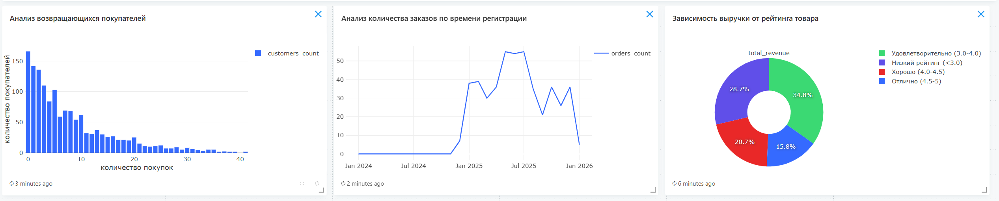

## fefu-data-analytics

# Project Overview
Project - Laboratory Work "Data Analysis of an Online Store"
Within the framework of this work, the following steps were performed:
- Create Postgresql database with 4 tables
- Create python data generator
- Create Redash dashboard to analyze and visualize data
- Create Jupyter notebook file to analyze data
- Configured Docker containers for PostgreSQL, Redash, Generator

# Setup
1. Clone the repository to your computer:
```bash
git clone https://github.com/yshelev/fefu-data-analytics.git
```

2. Run postgres container with the command:
```bash
docker compose up -d postgres
```

3. Run redash data setup: 
```bash 
docker-compose run --rm redash create_db
```

4. Run all containers with the command: 
```bash
docker compose up -d
```

To run Jupter notebook for analysis, you also need to complete the following steps:
```bash
python -m venv .venv
.venv/Scripts/activate
pip install -r requirements.txt
```

When launching Jupyter notebook, select the created environment as the Kernel.


# Redash visualizations


